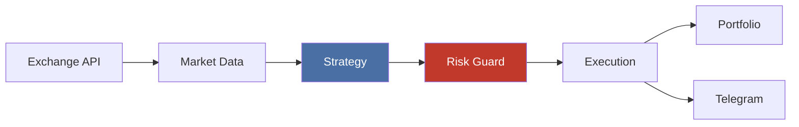
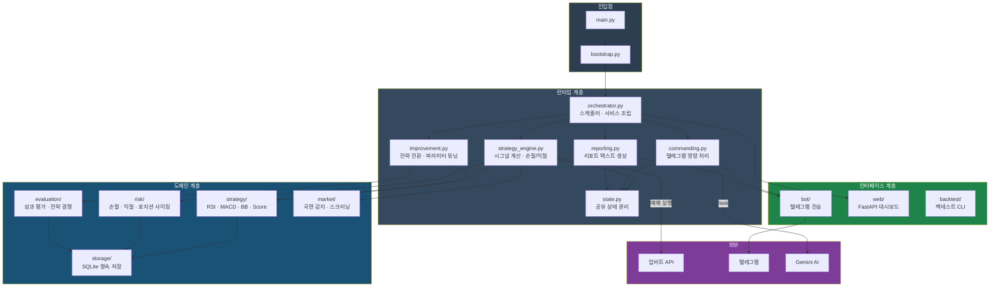
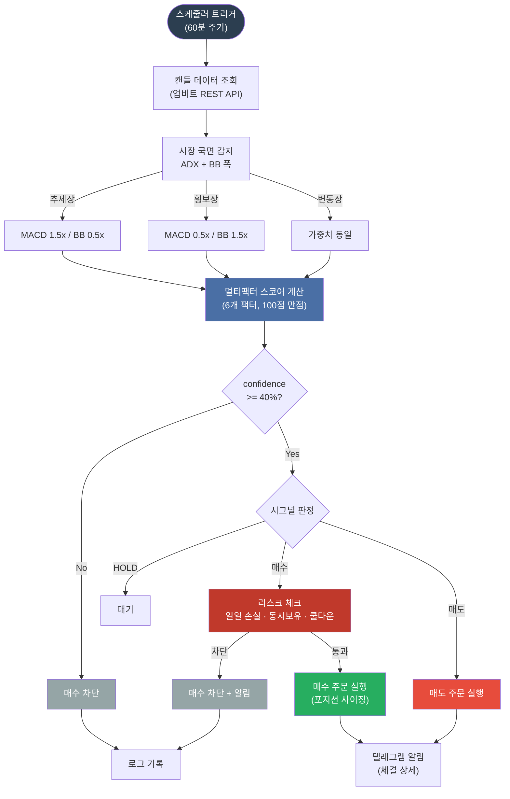
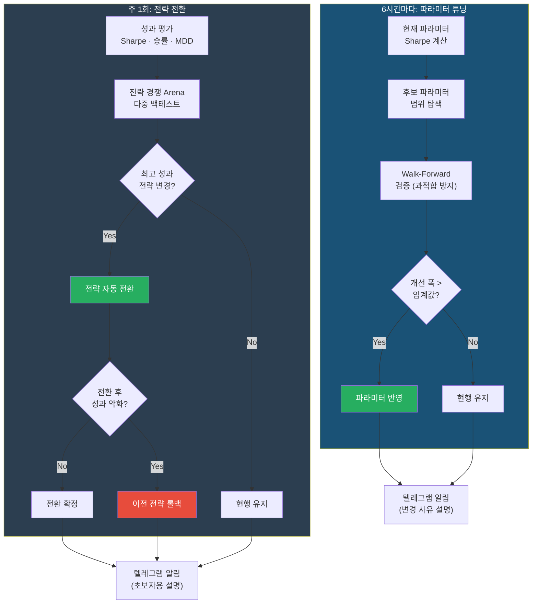

# cryptolight

업비트 기반 코인 자동매매 봇


-orange)

> 멀티팩터 스코어 전략 + 시장 국면 감지 + 자동 리스크 관리 + 자기개선 루프



## 시스템 아키텍처



## 매매 실행 플로우



## 리스크 관리 체계

```mermaid
flowchart LR
    subgraph PreTrade["사전 검증"]
        A1["confidence 게이트<br/>(40% 이상)"]
        A2["국면 가중치 게이트<br/>(저품질 국면 차단)"]
        A3["거래량 필터<br/>(평균 이상)"]
        A4["매매 쿨다운<br/>(중복 방지)"]
        A5["동시 보유 제한"]
    end

    subgraph Sizing["포지션 사이징"]
        B1["percent 모드<br/>(총자산 N%)"]
        B2["kelly 모드<br/>(켈리 공식)"]
        B3["fixed 모드<br/>(고정 금액)"]
        B4["1회 최대 금액 캡"]
        B5["Live 하드캡<br/>(50만원)"]
    end

    subgraph PostTrade["사후 보호"]
        C1["자동 손절<br/>(-10%)"]
        C2["자동 익절<br/>(+15%)"]
        C3["트레일링 스톱"]
        C4["일일 손실 한도<br/>(초과 시 매수 차단)"]
        C5["WebSocket 실시간<br/>가격 모니터링"]
    end

    PreTrade --> Sizing --> PostTrade

    style PreTrade fill:#e67e22,color:#fff
    style Sizing fill:#2980b9,color:#fff
    style PostTrade fill:#c0392b,color:#fff
```



## 자기개선 루프



## 빠른 시작

```bash
python3 -m venv .venv && source .venv/bin/activate
pip install -e ".[dev,web]"
cp .env.example .env    # 로컬 개발용
python -m cryptolight.main
```

> **필수 키**: `UPBIT_ACCESS_KEY`, `UPBIT_SECRET_KEY`, `TELEGRAM_BOT_TOKEN`, `TELEGRAM_CHAT_ID`
>
> 키 발급 방법은 [설정 가이드](docs/setup-guide.md)를 참고하세요.

## 주의 사항

- 이 봇은 실제 자금을 거래합니다. **`TRADE_MODE=paper`에서 먼저 테스트하세요**
- API 키가 포함된 `.env` 파일을 절대 Git에 커밋하지 마세요
- 자동 손절이 작동하더라도 극단적 급락장에서는 손실이 발생할 수 있습니다
- 과거 백테스트 성과는 미래 수익을 보장하지 않습니다

## 설정

로컬 개발은 저장소 루트의 `.env`를 그대로 써도 된다. 운영 환경에서는 `~/.config/cryptolight/cryptolight.env`를 권장한다. 런타임은 `CRYPTOLIGHT_ENV_FILE` 환경변수, `~/.config/cryptolight/cryptolight.env`, 레거시 경로 `~/.config/cryptolight/env`, 저장소 루트 `.env` 순서로 설정 파일을 찾는다.

운영 절차와 외부 설정 파일 배치는 [운영 가이드](docs/operations.md)에 정리되어 있다. 모든 설정 항목은 `.env.example`에 카테고리별 주석과 함께 들어 있다.

코드 구조와 런타임 계층 설명은 [아키텍처 가이드](docs/architecture.md)를 참고.

<details>
<summary><strong>주요 설정 항목</strong></summary>

| 항목 | 설명 | 기본값 |
|------|------|--------|
| `TRADE_MODE` | 거래 모드 (`paper` / `live`) | `paper` |
| `STRATEGY_NAME` | 매매 전략 | `score` |
| `TARGET_SYMBOLS` | 대상 종목 | `KRW-BTC,KRW-ETH` |
| `POSITION_SIZING_METHOD` | 포지션 사이징 (`fixed` / `percent` / `kelly`) | `percent` |
| `POSITION_RISK_PCT` | percent 모드 시 총자산 대비 주문 비율 | `5.0` |
| `STOP_LOSS_PCT` | 자동 손절 기준 | `-10.0` |
| `TAKE_PROFIT_PCT` | 자동 익절 기준 | `15.0` |
| `CANDLE_INTERVAL` | 캔들 주기 | `minute240` |
| `SCHEDULE_INTERVAL_MINUTES` | 분석 주기 (분) | `60` |
| `NOTIFICATION_LEVEL` | 알림 레벨 (`silent`/`minimal`/`normal`/`verbose`) | `normal` |
| `ENABLE_WEB` | 웹 대시보드 | `false` |
| `ENABLE_AUTO_PARAMETER_TUNING` | 파라미터 자동 조정 | `true` |
| `GOOGLE_API_KEY` | Gemini AI (/ask 명령) | (선택) |

전체 목록은 `.env.example` 또는 `src/cryptolight/config/settings.py` 참고.

</details>

## 실행

```bash
# 스케줄러 모드 (60분마다 자동 분석)
python -m cryptolight.main

# 1회 실행 후 종료
python -m cryptolight.main --once
```

## 매매 전략

기본 전략은 **Score (멀티팩터 스코어)**. RSI, MACD, 볼린저밴드, 거래량 6개 팩터를 종합하여 100점 만점으로 점수화하고, 시장 국면(추세/횡보/변동)에 따라 가중치를 자동 조정한다.

안전 장치: confidence 게이트(30% 미만 차단), 국면 가중치 게이트, 거래량 필터, 매수/매도 임계값 자동 튜닝(6시간마다).

```bash
STRATEGY_NAME=rsi python -m cryptolight.main        # RSI 단독
STRATEGY_NAME=macd python -m cryptolight.main       # MACD 단독
STRATEGY_NAME=bollinger python -m cryptolight.main  # 볼린저밴드 (평균회귀)
STRATEGY_NAME=ensemble python -m cryptolight.main   # 다수결 앙상블
```

전략별 상세 팩터 점수 및 국면 가중치는 [전략 상세](docs/strategy.md)를 참고.

## 텔레그램 알림

### 명령어

| 명령어 | 설명 |
|--------|------|
| `/info` | 시장 상태 + 초보자 해설 |
| `/criteria` | 현재 매수/매도 기준 설명 |
| `/tuning` | 자동 조정 이력 조회 |
| `/ask <질문>` | AI에게 질문 (Gemini) |
| `/status` | 봇 상태 |
| `/report` | 일일 요약 리포트 |
| `/mute` / `/unmute` | 자동 알림 끄기/켜기 |
| `/stop` | 긴급 거래 중지 (킬스위치) |

### 알림 레벨

`NOTIFICATION_LEVEL` 환경변수로 알림 상세도를 조절합니다.

| 레벨 | 받는 알림 |
|------|----------|
| `silent` | 킬스위치, 에러만 |
| `minimal` | + 매수/매도 체결, 손절/익절 |
| `normal` | + 일일 요약, 시작/종료, 시그널, 주기 현황 |
| `verbose` | + 매수 차단, 튜닝, 스크리닝 |

체결/손절/익절 알림에는 매수평단, 수량, 손익률, 손익금액이 포함됩니다.

## 웹 대시보드

글래스모피즘 디자인의 실시간 모니터링 대시보드.

```bash
ENABLE_WEB=true WEB_PORT=8090 python -m cryptolight.main
# http://localhost:8090
```

종목별 가격/RSI/시그널, 포트폴리오 손익, 시장 국면, 거래 내역을 한눈에 확인. HTTP Basic Auth 지원 (`WEB_USERNAME`, `WEB_PASSWORD` 설정).

## 로그 확인

- 기본 실행 로그는 `systemd user service` 기준 `journalctl --user -u cryptolight.service -f`
- 파일 로그는 `LOG_FILE=logs/cryptolight.log` 로 회전 저장
- 민감 정보(토큰/API 키)는 로그 포매터에서 마스킹

## 백테스트

```bash
python -m cryptolight.backtest --symbol KRW-BTC --strategy score --days 365
python -m cryptolight.backtest --symbol KRW-BTC --strategy score --days 365 --walk-forward
```

## 리스크 관리

- 포지션 사이징: 총자산의 N% 기반 (confidence 연동)
- 1회 최대 주문 금액 + Live 하드캡 (50만원)
- 일일 손실 한도 초과 시 매수 자동 차단
- 자동 손절(-10%)/익절(+15%)/트레일링 스톱
- 국면 가중치 게이트 (저품질 국면에서 매수 차단)
- 동시 보유 종목 수 제한 + 매매 쿨다운
- 중복 시그널 방지
- API 장애 시 지수 백오프 (주문 API는 재시도 안 함)

## 자기개선 루프

성과 평가 -> 전략 경쟁(Arena) -> 자동 전환/롤백 -> 파라미터 미세조정을 주기적으로 실행. 텔레그램으로 무엇이 왜 바뀌었는지 초보자용 설명과 함께 알림.

상세 내용은 [전략 상세](docs/strategy.md#자기개선-루프)를 참고.

## 보안

- `.env` 파일은 `.gitignore`에 포함되어 절대 커밋되지 않습니다
- API 키는 환경변수로만 관리 (코드에 하드코딩 금지)
- 웹 대시보드는 `127.0.0.1`에만 바인딩 (외부 노출 차단)
- 웹 대시보드 API에 민감 정보(API 키 등) 미노출
- CSP 헤더, XSS 방어, OpenAPI 문서 비활성화
- 주문 API 실패 시 재시도하지 않음 (중복 주문 방지)
- JWT 토큰은 매 요청마다 새로 생성 (재사용 없음)

## 배포

```bash
# Docker
docker compose up -d

# systemd (호스트 재부팅 시 자동 복구)
systemctl --user status cryptolight.service
```

상세 배포 가이드는 [배포 문서](docs/deployment.md), 운영 명령과 로그 확인은 [운영 가이드](docs/operations.md)를 참고.

## 개발

```bash
pytest                # 전체 테스트 (현재 240개)
ruff check src/       # 린트
ruff format src/      # 포맷
```

## 라이선스

MIT
