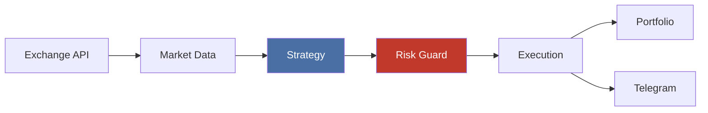

# cryptolight

업비트 기반 코인 자동매매 봇


-orange)

> 멀티팩터 스코어 전략 + 시장 국면 감지 + 자동 리스크 관리 + 자기개선 루프



## ⚡ 빠른 시작

```bash
python3 -m venv .venv && source .venv/bin/activate
pip install -e ".[dev,web]"
cp .env.example .env    # 필수 4개 키 입력
python -m cryptolight.main
```

> **필수 키**: `UPBIT_ACCESS_KEY`, `UPBIT_SECRET_KEY`, `TELEGRAM_BOT_TOKEN`, `TELEGRAM_CHAT_ID`
>
> 키 발급 방법은 [설정 가이드](docs/setup-guide.md)를 참고하세요.

## ⚠️ 주의 사항

- 이 봇은 실제 자금을 거래합니다. **`TRADE_MODE=paper`에서 먼저 테스트하세요**
- API 키가 포함된 `.env` 파일을 절대 Git에 커밋하지 마세요
- 자동 손절이 작동하더라도 극단적 급락장에서는 손실이 발생할 수 있습니다
- 과거 백테스트 성과는 미래 수익을 보장하지 않습니다

## ⚙️ 설정

`.env.example`을 복사하여 `.env`를 생성합니다. 필수 키 4개만 채우면 기본값으로 바로 실행 가능합니다.

모든 설정 항목은 `.env.example`에 카테고리별 주석과 함께 정리되어 있습니다.

<details>
<summary><strong>주요 설정 항목</strong></summary>

| 항목 | 설명 | 기본값 |
|------|------|--------|
| `TRADE_MODE` | 거래 모드 (`paper` / `live`) | `paper` |
| `STRATEGY_NAME` | 매매 전략 | `score` |
| `TARGET_SYMBOLS` | 대상 종목 | `KRW-BTC,KRW-ETH` |
| `MAX_ORDER_AMOUNT_KRW` | 1회 최대 주문금액 | `50000` |
| `SCHEDULE_INTERVAL_MINUTES` | 분석 주기 (분) | `5` |
| `ENABLE_WEB` | 웹 대시보드 | `false` |
| `ENABLE_AUTO_PARAMETER_TUNING` | 파라미터 자동 조정 | `true` |
| `GOOGLE_API_KEY` | Gemini AI (/ask 명령) | (선택) |

전체 목록은 `.env.example` 또는 `src/cryptolight/config/settings.py` 참고.

</details>

## 🚀 실행

```bash
# 스케줄러 모드 (5분마다 자동 분석)
python -m cryptolight.main

# 1회 실행 후 종료
python -m cryptolight.main --once
```

## 📈 매매 전략

기본 전략은 **Score (멀티팩터 스코어)**. RSI, MACD, 볼린저밴드, 거래량 6개 팩터를 종합하여 100점 만점으로 점수화하고, 시장 국면(추세/횡보/변동)에 따라 가중치를 자동 조정한다.

안전 장치: confidence 게이트(40% 미만 차단), 거래량 필터, 매수/매도 임계값 자동 튜닝(6시간마다).

```bash
STRATEGY_NAME=rsi python -m cryptolight.main        # RSI 단독
STRATEGY_NAME=macd python -m cryptolight.main       # MACD 단독
STRATEGY_NAME=bollinger python -m cryptolight.main  # 볼린저밴드
STRATEGY_NAME=ensemble python -m cryptolight.main   # 다수결 앙상블
```

전략별 상세 팩터 점수 및 국면 가중치는 [전략 상세](docs/strategy.md)를 참고.

## 🤖 텔레그램 명령어

| 명령어 | 설명 |
|--------|------|
| `/info` | 시장 상태 + 초보자 해설 |
| `/criteria` | 현재 매수/매도 기준 설명 |
| `/tuning` | 자동 조정 이력 조회 |
| `/ask <질문>` | AI에게 질문 (Gemini) |
| `/status` | 봇 상태 |
| `/report` | 일일 요약 리포트 |
| `/mute` / `/unmute` | 자동 알림 끄기/켜기 |
| `/stop` | 긴급 거래 중지 (킬스위치) |

## 📊 웹 대시보드

글래스모피즘 디자인의 실시간 모니터링 대시보드.

```bash
ENABLE_WEB=true WEB_PORT=8090 python -m cryptolight.main
# http://localhost:8090
```

종목별 가격/RSI/시그널, 포트폴리오 손익, 시장 국면, 거래 내역을 한눈에 확인. HTTP Basic Auth 지원 (`WEB_USERNAME`, `WEB_PASSWORD` 설정).

## 🧪 백테스트

```bash
python -m cryptolight.backtest --symbol KRW-BTC --strategy score --days 365
python -m cryptolight.backtest --symbol KRW-BTC --strategy score --days 365 --walk-forward
```

## 🛡️ 리스크 관리

- 1회 최대 주문 금액 + Live 하드캡 (50만원)
- 일일 손실 한도 초과 시 매수 자동 차단
- 자동 손절/익절/트레일링 스톱
- 동시 보유 종목 수 제한 + 매매 쿨다운
- 중복 시그널 방지
- API 장애 시 지수 백오프 (주문 API는 재시도 안 함)

## 🔄 자기개선 루프

성과 평가 → 전략 경쟁(Arena) → 자동 전환/롤백 → 파라미터 미세조정을 주기적으로 실행. 텔레그램으로 무엇이 왜 바뀌었는지 초보자용 설명과 함께 알림.

상세 내용은 [전략 상세](docs/strategy.md#자기개선-루프)를 참고.

## 🐳 배포

```bash
# Docker
docker compose up -d

# systemd (호스트 재부팅 시 자동 복구)
systemctl --user status cryptolight.service
```

상세 배포 가이드는 [배포 문서](docs/deployment.md)를 참고.

## 🧑‍💻 개발

```bash
pytest                # 전체 테스트 (216개)
ruff check src/       # 린트
ruff format src/      # 포맷
```

## 라이선스

MIT
